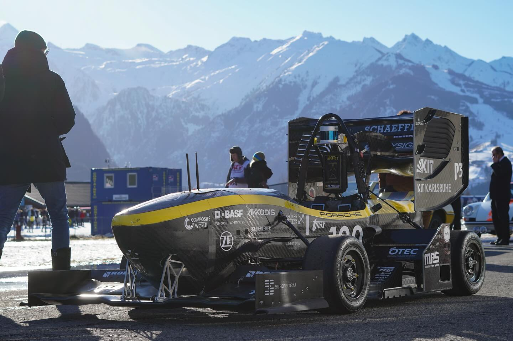
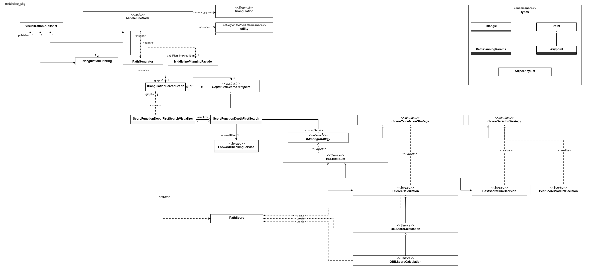

# Score Function DFS for Path Planning in Autonomous Racing

## Summary

Here, I present a path planning algorithm I developed at KA-RaceIng for its autonomous electric race car, the KIT24.
Given a map of cones marking the track, the algorithm finds the path through the race track.
It superseded KA-RaceIngs previous approach to path planning because it can tolerate mistakes in the map (e.g. false positive or false negative cone detection).

  
  &nbsp;
  &nbsp;
  &nbsp;
  &nbsp;
  &nbsp;
  &nbsp;
  

## Demo

Witness our race car in action: executing precise maneuvers with path planning on the race track (first) and employing cornering velocity planning, another technique I personally realized (second).

<https://github.com/mabdn/score-function-dfs/assets/93079021/66038b40-8097-43d2-b00d-ff6f92832168>

<https://github.com/mabdn/score-function-dfs/assets/93079021/85f6e870-fdb0-4f2b-966b-64d09f0ee609>

This RVIZ visualization showcases how my path-planning algorithm performs. It was recorded during real-world driving.

<https://github.com/mabdn/score-function-dfs/assets/93079021/54c0ab32-bf42-401e-b637-bb3fde20ae58>

## Description

This repository presents one part of my contribution to KA-RaceIng's autonomous racing software during a 7-month part-time (15h/week) position as **Autonomous Driving Software Engineer** at Karlsruhe Institute of Technology's Formula Student team KA-RaceIng.

### Results and Experience Gained

- **Increased path planning safety** to **50% fewer runs with planning mistakes** by designing the depth-frist search path planning algorithm presented in this repository
- **Reduced the autonomous lap time by 4%** in the cornering simulation using **C++** and **ROS** by developing a velocity planning algorithm that **estimates the cornering stability** of the car and accelerates the car to drive at its **stability limit**
- **Led a team of physicists, mechatronics engineers, and computer scientists** decreasing the **scrum sprint time from 4 weeks to 2 weeks** by improving communication of hardware and software teams with a systematic feedback cycle
- **Automated the project’s GitLab CI pipeline** to check code style and formatting rules automatically by creating a **custom Docker Linux image**

### What is KA-RaceIng and Formula Student?

KA-RaceIng is a racing team of students from *Karlsruhe Institute of Technology* competing in *Formula Student*.
*Formula Student* is an international engineering competition. 50-member teams from the world's best universities design, build, and code autonomous electric full-sized race cars.

KA-RaceIng is one of the world's best formula student teams in autonomous racing. E.g.,

- 2nd place in Formula Student Germany 2023 (driverless)
- 1st place in Formula Student Hungary 2022 (driverless)
- 1st place in Formula Student Germany, Hungary, and Czech 2021 (driverless)

### Technologies Used

- **C++17** Programming Language
- **ROS** Robotics Software Framework
- **Docker Containers** for Continous Integration
- **GoogleTest** Unit Test Framework

## Software Design

### Overall Structure

My algorithm finds the middle line through the race track in a given map. The map is given as a list of cone positions. This list is triangulated with a Delaunay Triangulation. Then, my custom depth-first search algorithm explores many possible paths through the map. While backtracking the depth-first search graph, score functions are used to decide which path is the best.

  

The `middleline_pkg` is the package I implemented to realize my algorithm. It is responsible for the calculation and planning of the middleline trajectory for the autonomous vehicle. The package is built around several key concepts and files, which are explained below.

### `DepthFirstSearchTemplate`

This file implements a generic depth-first search (DFS) algorithm. The DFS is used to traverse the triangulation graph and find the optimal path. The DFS algorithm is templated, allowing for different scoring and forward-checking strategies to be used.

### `ScoreFunctionDepthFirstSearch`

These files implement a specific DFS strategy that uses a scoring function to evaluate the quality of the paths. The scoring function is used to guide the DFS towards the most promising paths.

### `ScoreCalculation`

This implements a strategy design pattern (`HSLScoreCalculation`, `CHSLScoreCalculation`, `WCHSLScoreCalculation`) allowing developers to choose from different scoring strategies. The scoring strategies evaluate the quality of a path section based on various properties of the path.

### `TriangulationFiltering`

The `TriangulationFiltering` class is responsible for preprocessing the triangulation graph before the path planning starts. It removes triangles that are not plausible.

### `ForwardCheckingService`

The `ForwardCheckingService` class checks if a forward step in the DFS is allowed. For example, it prevents turns that would be too sharp to drive.

## License

The code I wrote in this project is private. It is actively used by the KA-RaceIng team. It is the core of path planning at KA-RaceIng and is essential for the team's success in autonomous racing. Hence, I cannot publish any of this code here. I can give you more insights and show you code in a personal discussion, though.
